# Rock Band General Helper for REAPER 4

Authoring utilities for custom Rock Band songs in REAPER 4.20. This is the
legacy Windows/Python edition of
[`rock-band-reaper-helpers-vkr`](https://github.com/VeeKiraRay/rock-band-reaper-helpers-vkr),
focused on the General Helper.

The helper provides a single window for keeping an authoring checklist,
validating and reducing instrument difficulties, interpreting ASCII tablature,
editing MIDI patterns, authoring VENUE and EVENTS data, and choosing Rock Band
metadata.

## Requirements

- Windows with **REAPER 4.20**. The verified and supported configuration is the
  64-bit edition.
- **Python 2.7.18** with Tkinter, configured in REAPER under **Preferences >
  Plug-ins > ReaScript**. Python must have the same 32-bit or 64-bit
  architecture as REAPER; the verified configuration is 64-bit Python.
- A Rock Band authoring project using the usual track names, such as
  `PART GUITAR`, `PART DRUMS`, `EVENTS`, and `VENUE`

No ReaPack, ReaImGui, SWS, or third-party Python package is required. The
interface uses the Tkinter installation bundled with Python 2.7.

The helper has no known intentional 64-bit-only code, but the 32-bit editions
of REAPER and Python have not been tested. Treat a matching 32-bit setup as
experimental rather than supported.

## Installation

1. Download or clone the project and keep its folders together.
2. In REAPER, open **Actions > Show action list**.
3. Choose **Load ReaScript** and select `rock_band_general_helper_vkr.py` from
   the project root.
4. Assign the new action to a toolbar button or another mouse-driven control.
5. Close the Action List, then launch the helper.

Keep the helper's package, `lib`, and `resources` folders beside the launcher.
Register only the root `rock_band_general_helper_vkr.py` for normal use.

Optional Venue spritesheets and their expected extraction layout are described
in the [resource installation guide](resources/INSTALLATION_GUIDE.md).

## Optional Pillow installation

The optional GIF spritesheet packages work through Tkinter without Pillow.
Installing Pillow enables the higher-color JPEG packages used by Venue
previews.

See comparison table for jpeg and gif at the [end of the page](#jpeg-and-gif-comparison-table)

REAPER 4.20 uses Python 2.7, so install the pinned **Pillow 6.2.2** release.
Newer Pillow releases do not support Python 2.7. Close REAPER before changing
its Python environment.

First check the architecture of the exact Python installation configured in
REAPER. Adjust the path if yours is installed elsewhere:

```bat
C:\Python27\python.exe -c "import struct; print(struct.calcsize('P') * 8)"
```

The result must match REAPER: `64` for 64-bit REAPER or `32` for 32-bit
REAPER. If that interpreter has a working `pip`, install the pinned binary
package:

```bat
C:\Python27\python.exe -m pip install --only-binary=:all: Pillow==6.2.2
```

If the old version of `pip` cannot connect to PyPI, download the appropriate
wheel from [Pillow 6.2.2 on PyPI](https://pypi.org/project/Pillow/6.2.2/) using
another computer and install the local file. Use the `win_amd64` wheel for the
verified 64-bit configuration, or `win32` only for a matching experimental
32-bit REAPER/Python configuration:

```bat
C:\Python27\python.exe -m pip install C:\path\to\Pillow-6.2.2-cp27-cp27m-win_amd64.whl
```

Verify the installation with the same interpreter:

```bat
C:\Python27\python.exe -c "import PIL; from PIL import Image, ImageTk; print(PIL.__version__)"
```

The expected version is `6.2.2`. Restart REAPER afterward. If the helper still
cannot import Pillow, it is usually using a different Python installation from
the one where Pillow was installed. Pillow is not required when a GIF package
is designated, but the helper does not silently switch away from an installed
higher-priority JPEG package. See the resource installation guide for package
priority and selection behavior.

Python 2.7 and Pillow 6.2.2 are end-of-life software. Use this old image decoder
only with trusted spritesheets.

## Quick start

1. Open the REAPER project you want to work on.
2. Launch **Rock Band General Helper VKR** from its toolbar button.
3. Pick one of the six main tabs: **General**, **Difficulty**, **Tab Input**,
   **MIDI**, **Venue**, or **Metadata**.
4. Read the Result panel after each action. Use **Copy result** when you want to
   keep or share the report.
5. Close the helper window when you are finished.

The helper stays above REAPER by default. Clear **Always on top** in the bottom
bar if you prefer normal window stacking.

## General

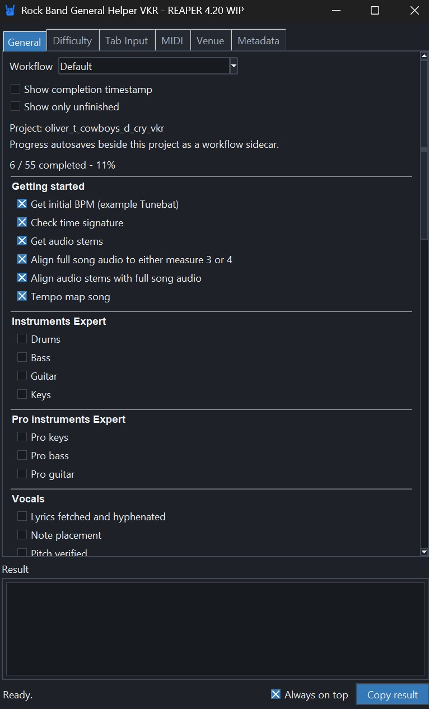

General contains a project checklist based on
`resources/workflow/Default.txt`. Check items off as you author the song, hide
completed entries when you want a shorter view, and optionally show completion
times.

For a saved REAPER project, checklist progress is stored beside the project in
a `.rbhelper-workflow.json` file. Each project has its own progress. An unsaved
project keeps its checklist only for the current helper session.

You can create another workflow by copying `Default.txt` in
`resources/workflow`, renaming the copy, and editing it as plain text. Lines in
square brackets are section headings; other non-empty lines are checklist
items. Text in braces adds a tooltip to an item.

## Difficulty

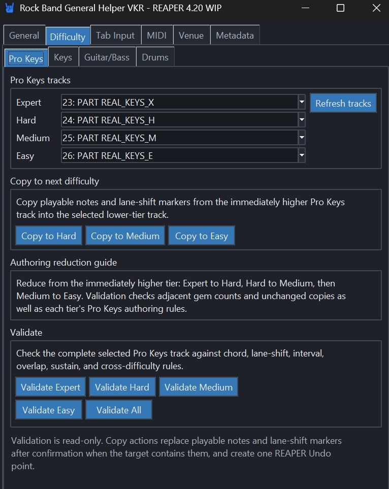

Difficulty validates authored charts and can copy a higher difficulty down as
a starting point for reduction. It supports:

- Pro Keys on `PART REAL_KEYS_X`, `PART REAL_KEYS_H`, `PART REAL_KEYS_M`, and
  `PART REAL_KEYS_E`
- 5-lane Keys on `PART KEYS`
- Guitar and Bass on `PART GUITAR` and `PART BASS`
- Drums on `PART DRUMS`

Choose Expert, Hard, Medium, Easy, or all difficulties, then run validation to
see authoring issues in the Result panel. The checks cover the rules relevant
to each instrument, including chords, spacing, sustains, overlaps, density,
markers, lane shifts, and adjacent-tier reduction.

**Copy to Hard**, **Copy to Medium**, and **Copy to Easy** replace the target
difficulty with material from the tier immediately above it. Existing target
notes require confirmation, and an accepted change creates one REAPER Undo
point. Keys can optionally use the same-tier Pro Keys chart as a reduction
guide.

Validation is an authoring aid, not an official or definitive rules reference.
Review every result in the context of the song and current community guidance.

## Tab Input

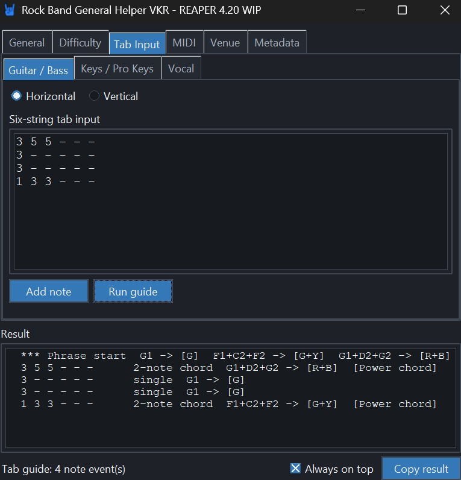

Tab Input is a read-only reference guide. It interprets ASCII tablature and
reports suitable Rock Band gems or pitches; it never writes notes to the
project.

- **Guitar / Bass** maps fret shapes to 5-lane gem combinations and explains
  recognized chord shapes.
- **Keys / Pro Keys** finds a useful octave shift into the C2-C4 range, reports
  notes that remain out of range, and can use the full animation range.
- **Vocal** shifts notes into the C1-C5 vocal range and reports wide or
  out-of-range material.

Horizontal input uses six space-separated tokens from low E to high e, for
example `x 3 2 0 1 0`. Vertical input uses the familiar six-line ASCII layout,
with high e on top. Blank lines mark phrase breaks.

## MIDI

MIDI contains Length and Pattern tools.

### Length

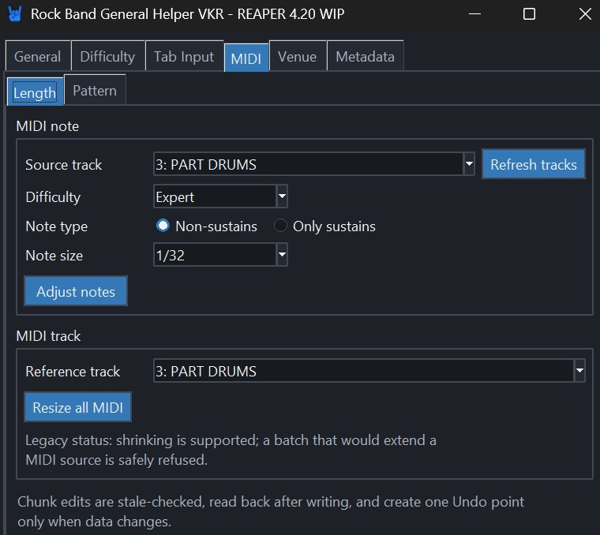

Length can normalize non-sustain note lengths or sustain gaps for the selected
difficulty range. When a time selection is active, the action is limited to
that range. It can also make existing MIDI items match a common length when
that operation does not require extending their underlying MIDI sources.

### Pattern

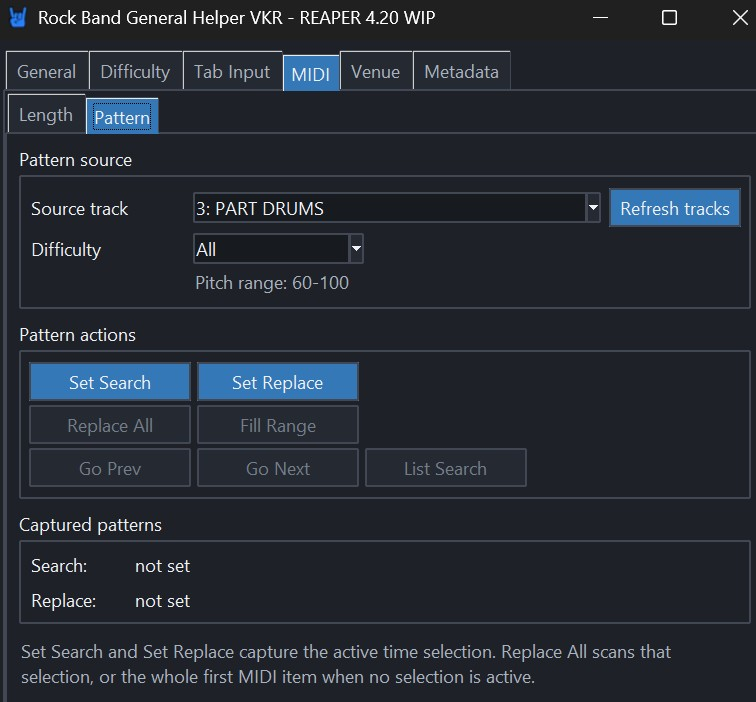

Pattern captures Search and Replace material from the current time selection.
It can list matching passages, navigate between them, replace all matches, or
tile the replacement pattern across a selected range. Captures are cleared
when you switch to another REAPER project tab.

MIDI actions require ordinary, unpooled 480 PPQ MIDI sources at a normal play
rate. If the helper reports that an item is shared, changed, truncated, or
otherwise unsafe to edit, leave it unchanged and resolve that condition in
REAPER first.

## Venue

Venue reads and authors text events on the `VENUE` and `EVENTS` tracks. Its
seven sub-tabs cover inspection, generation, manual authoring, and preview.

### Actions

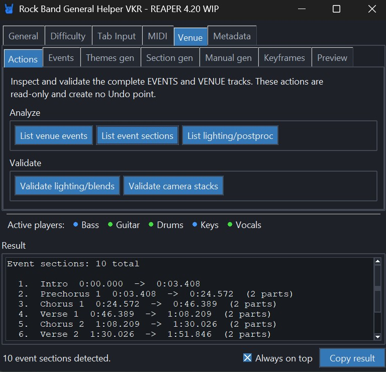

Use Actions to list VENUE events and practice sections, or to validate lighting
keyframes, blends, and camera coverage for possible band lineups. These actions
are read-only. An active time selection limits validation findings where
applicable.

### Events

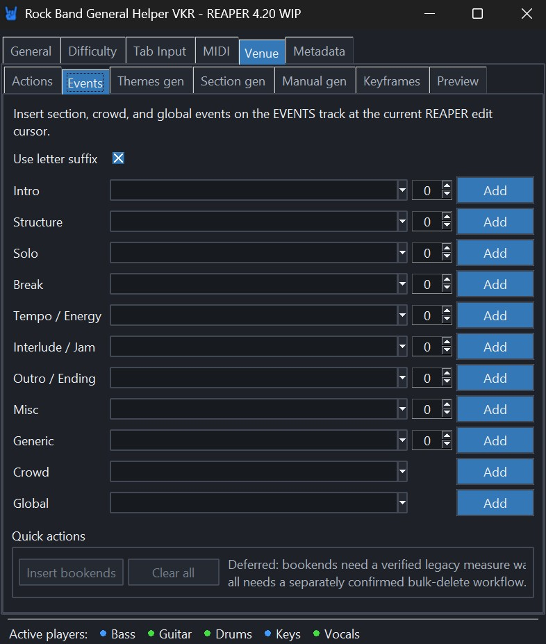

Events inserts practice-section, crowd, and global text events into an
`EVENTS` MIDI item at the edit cursor. It validates duplicates, ordering,
numbered and letter-suffixed sections, and conflicting events before writing.

The number stepper chooses the section number. Set it to `0` for the bare or
unnumbered selection. With **Use letter suffix** off, that produces an event
such as `[prc_verse]` instead of `[prc_verse_1]`. When letter suffixes are
enabled, supported sections use forms such as `[prc_verse_a]` or
`[prc_verse_1a]` instead.

### Themes gen

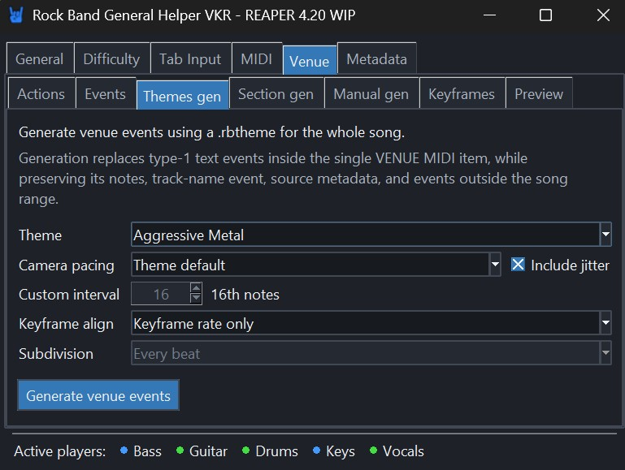

Themes gen creates whole-song VENUE authoring from a `.rbtheme` file. Put your
own theme files in `resources/themes`, reopen the helper, and choose a theme.
You can override camera pacing, add timing jitter, choose keyframe alignment,
and select instrument-aware keyframe grids.

Theme files are not bundled with this project. Generation requires one
unpooled MIDI item on the `VENUE` track.

### Section gen

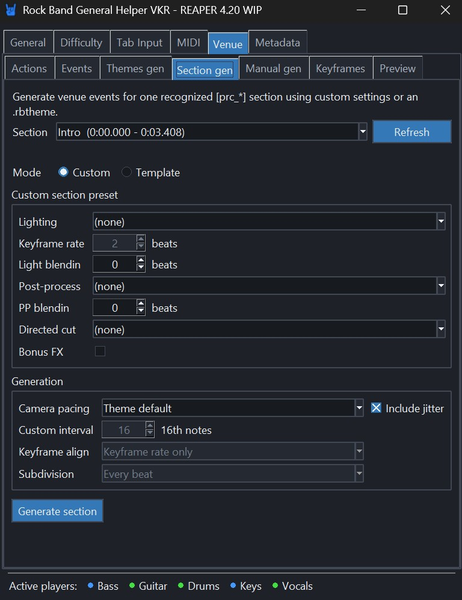

Section gen reads `[prc_*]` markers from `EVENTS` and regenerates only the
selected song section. Use Template mode to apply the matching preset from a
theme, or Custom mode to choose lighting, post-processing, blends, camera
pacing, a directed cut, and bonus FX yourself.

### Manual gen

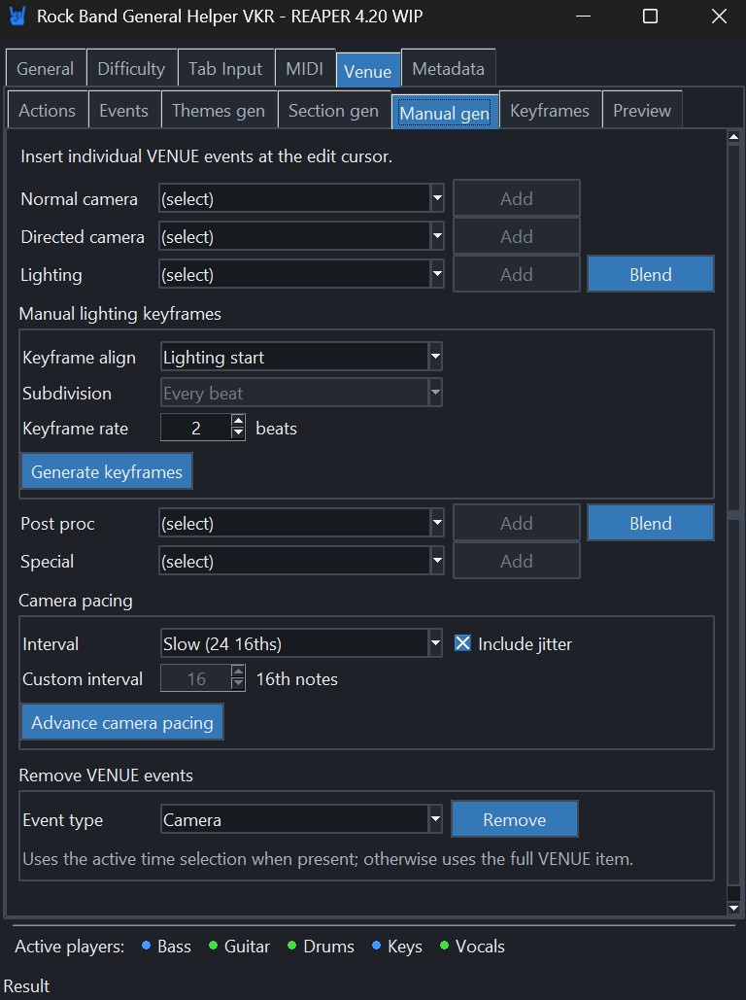

Manual gen inserts individual camera, lighting, post-process, and special
events at the edit cursor. It can add blend anchors, advance the cursor using a
camera cadence, generate a manual-lighting keyframe train, and remove selected
event categories from the time selection or the whole VENUE item.

Hovering supported controls shows a camera, lighting, or post-process preview.
GIF image packages work without additional software; a compatible Pillow
installation displays the JPEG packages.

### Keyframes

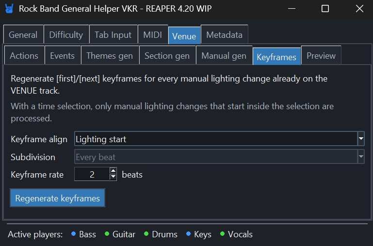

Keyframes regenerates `[first]` and `[next]` animation events for manual
lighting already authored on `VENUE`. Choose the alignment, subdivision, and
rate. With a time selection, only lighting triggers that begin inside the
selection are regenerated.

### Preview

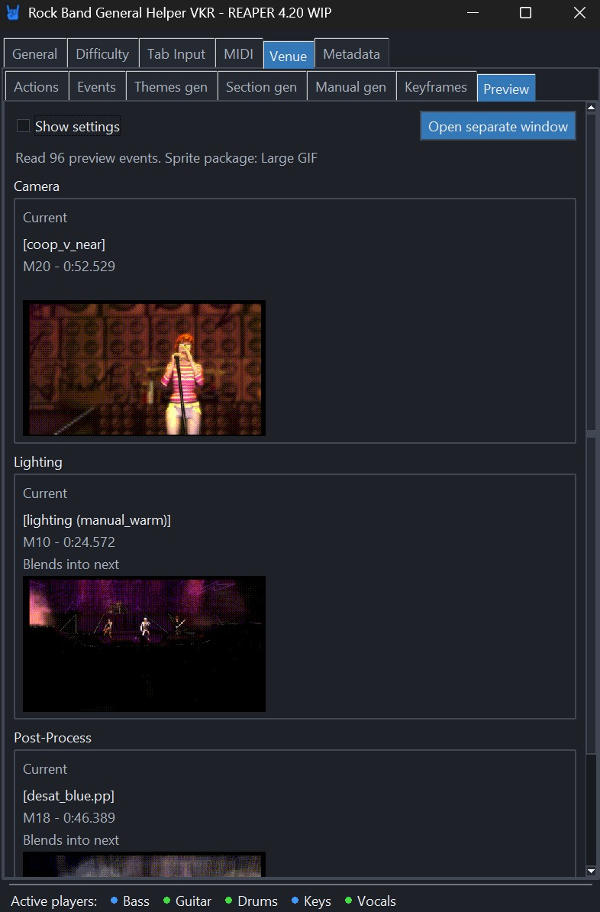

Preview follows the play cursor during playback and the edit cursor while
stopped. It shows the current camera, lighting, and post-process state, with an
option to include the surrounding events. Choose the active Bass/Guitar/Keys
lineup so stacked camera events resolve as they will in game.

Use **Open separate window** to keep Preview visible beside another General
Helper view. This is the supported way to use multiple helper windows in one
session.

The Active players row below every Venue sub-tab shows whether Bass, Guitar,
Drums, Keys, and Vocals are active, idle, muted, or unavailable at the current
cursor position. Hover an instrument for details.

## Metadata

Metadata provides two read-only song-level tools.

### Genre

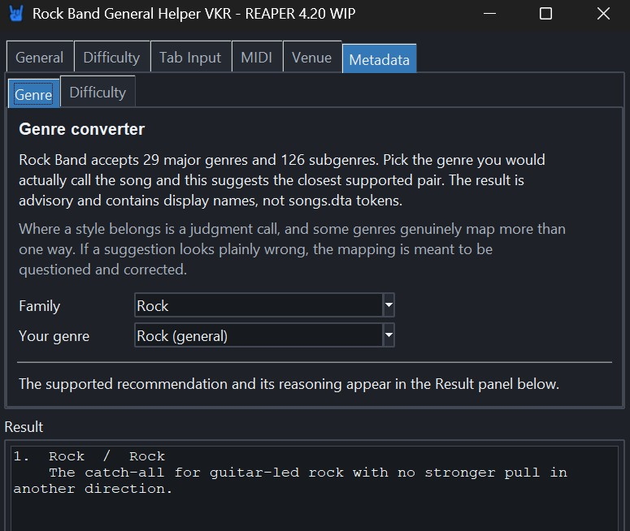

Genre maps a real-world style to the closest supported Rock Band major genre
and subgenre. Pick a broad family, then the description that best matches the
song. The result may offer multiple candidates and explain what distinguishes
them. The displayed names are guidance, not `songs.dta` tokens.

### Difficulty

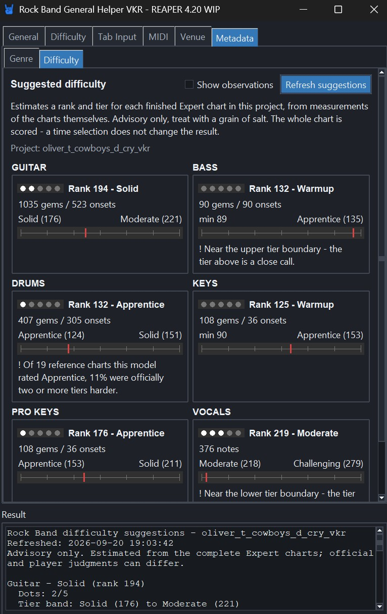

Metadata Difficulty analyzes the completed Expert charts for Guitar, Bass,
Drums, Keys, Pro Keys, and Vocals, then suggests game-style ranks and tiers.
Choose **Refresh suggestions** to scan the whole chart. Opening the tab alone
does not scan or modify the project.

The result is advisory. It includes plain-language observations and warnings
that help explain unusual measurements, but it is not a substitute for play
testing and author judgment.

## Important REAPER 4 behavior

While the helper is open, REAPER remains mouse-interactive but its keyboard
shortcuts are unavailable. This is a limitation of the Tkinter event loop in
REAPER 4.20. Closing the helper restores normal keyboard handling.

Do not start another persistent Python ReaScript while the General Helper is
open. REAPER's embedded Python runtime can destabilize the script that was
opened first and may crash when a window closes. Save your project first, keep
one persistent Python action open at a time, and create any additional Preview
window from inside the General Helper.

Launching with the Action List's **Run** button leaves that Action List dialog
waiting until the helper closes. A toolbar button is the recommended launcher.

## Troubleshooting

**The script cannot import one of its modules.**

Keep the complete project layout together. The launcher must remain beside the
`rock_band_general_helper_vkr`, `lib`, and `resources` folders.

**A project track is not found.**

Use the standard Rock Band track name expected by the action, and make sure the
track contains a MIDI item where required.

**A MIDI or Venue edit is refused.**

Read the Result panel. The helper intentionally refuses pooled/shared sources,
unsupported item layouts, stale inputs, and other edits it cannot verify
safely.

**Venue generation has no themes to select.**

Copy one or more `.rbtheme` files into `resources/themes`, then reopen the
helper.

**Venue preview shows text instead of images.**

The action still works. Check that the `resources/img/spritesheets` folders are
present. Preview reports the designated package when a sheet is missing or
unreadable. JPEG packages additionally need a Python 2-compatible Pillow
build; GIF packages do not. Restart the helper after changing image packages.

## Jpeg and gif comparison table

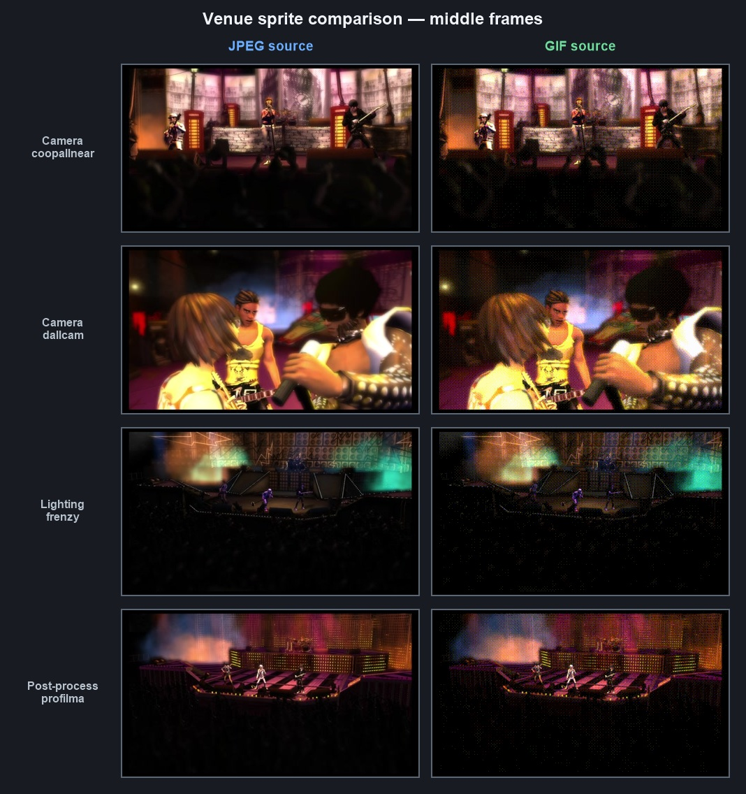

## License

MIT — see [LICENSE](LICENSE).

Contributor notes, compatibility details, implementation status, and current
development work are kept in [README_TECHNICAL.md](README_TECHNICAL.md).
